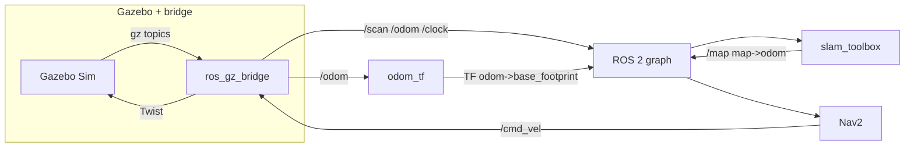
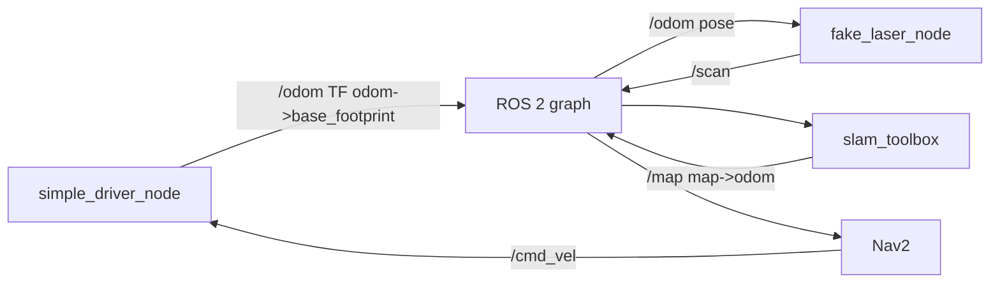

# Robotont Gazebo + Nav2 + SLAM + Foxglove
---

## 1. What we simulate

| Piece | Role |
|--------|------|
| **Robot** | URDF from `robotont_description` (Gen3-style Robotont mesh + kinematics for visualization). One **base footprint**, one **2D lidar** frame (`base_scan`). |
| **World** | Small indoor room with walls and boxes. **Gazebo** mode: SDF + simplified physics proxy. **Custom** mode: same geometry idea as JSON (`worlds/*.json`), no Gazebo physics—**kinematic** integration + **ray-cast** laser. |
| **Odometry** | **Gazebo:** Gazebo publishes `/odom` (world-referenced); `odom_tf` republishes as TF `odom → base_footprint`. **Custom:** `simple_driver_node` integrates `/cmd_vel` and publishes `/odom` + TF `odom → base_footprint` (no slip). |
| **Laser** | **Gazebo:** `/scan` via `ros_gz_bridge`. **Custom:** `fake_laser_node` publishes `sensor_msgs/LaserScan` on `/scan` from robot pose + JSON segments. |
| **SLAM** | **slam_toolbox** in **online async mapping** mode: subscribes to `/scan`, uses `odom` and `base_footprint`, publishes **`/map`** (`nav_msgs/OccupancyGrid`) and TF **`map → odom`**. |
| **Navigation** | **Nav2** stack (planner, controller, BT navigator, costmaps, smoother, velocity smoother). Goals use the **`navigate_to_pose`** action. **Not** using Nav2’s map server for localization—you are **building** the map with SLAM, not localizing in a pre-built map. |

---

## 2. Nav2 and SLAM quick context

**Frames (TF2)**

- **`map`**: SLAM’s global frame; origin and orientation of the occupancy grid.
- **`odom`**: Continuous odometry from the simulator (drift possible in real robots; here it is idealized).
- **`base_footprint` / `base_link` / `base_scan`**: Robot and sensor.

Typical chain: **`map → odom → base_footprint → …`**. slam_toolbox publishes **`map → odom`**. The simulator (Gazebo path + `odom_tf`, or custom driver) publishes **`odom → base_footprint`**.

**`/map`**

- Message type: **`nav_msgs/msg/OccupancyGrid`**.
- Published by **slam_toolbox** while mapping. Values: `-1` unknown, `0–100` cost, `100` lethal.

**Nav2 here**

- **Input:** laser **`/scan`**, TF, **`/map`** for global costmap, odometry.
- **Goal API:** `nav2_msgs/action/NavigateToPose` on action name **`/navigate_to_pose`** (standard Nav2).
- **Output:** smoothed velocity on **`/cmd_vel`** (`geometry_msgs/msg/Twist`). In this launch, internal **`cmd_vel_nav`** is remapped through **velocity_smoother** → **`/cmd_vel`**.
- **Lifecycle:** `lifecycle_manager_navigation` autostarts the Nav2 nodes listed in the launch file.

**Remap note:** Nav2 nodes remap **`/tf` → `tf`** and **`/tf_static` → `tf_static`** so they line up with slam_toolbox’s TF topic names in this bringup.

---

## 3. Data flow

### Gazebo mode (`ROBOTONT_WORLD_MODE=gazebo`)



- **`/clock`**: simulation time (`use_sim_time:=true` for Gazebo stack).
- **`goal_bridge`**: subscribes **`/goal_pose`** (`geometry_msgs/msg/PoseStamped`), sends goals to **`/navigate_to_pose`**.

### Custom JSON mode (`ROBOTONT_WORLD_MODE=custom`)



- **`use_sim_time`**: `false` for driver, laser, slam, and Nav2 in this mode (wall clock).
- Initial pose for the driver is YAML-driven: `config/simple_sim_driver.yaml` (`initial_x`, `initial_y`, `initial_theta`).

### `simple` / Foxglove-only mode

`robotont_foxglove.launch.py` — URDF + teleop-style demo **without** Nav2/SLAM/Gazebo from this compose path. See launch file for arguments (`linear_speed`, `angular_speed`, etc.).

---

## 4. ROS interface reference

### Topics (main ones)

| Topic | Type | Typical publisher → consumer |
|--------|------|------------------------------|
| `/scan` | `sensor_msgs/msg/LaserScan` | Gazebo bridge or `fake_laser` → slam_toolbox, Nav2 costmaps |
| `/odom` | `nav_msgs/msg/Odometry` | Gazebo bridge or `simple_driver` → slam_toolbox, Nav2, `fake_laser` |
| `/map` | `nav_msgs/msg/OccupancyGrid` | slam_toolbox → Nav2 global costmap, Foxglove, `map_saver_cli` |
| `/tf`, `/tf_static` | `tf2_msgs/msg/TFMessage` | `robot_state_publisher`, slam_toolbox, Nav2, Gazebo-related frames |
| `/cmd_vel` | `geometry_msgs/msg/Twist` | Nav2 velocity smoother → simulator (Gazebo via bridge or `simple_driver`) |
| `/goal_pose` | `geometry_msgs/msg/PoseStamped` | Foxglove / you → `goal_bridge` |
| `/robot_description` | `std_msgs/msg/String` | `robot_state_publisher` (via parameter) / Foxglove |
| `/clock` | `rosgraph_msgs/msg/Clock` | Gazebo mode only; drives `use_sim_time` |

### Actions

| Name | Type | Purpose |
|------|------|---------|
| `/navigate_to_pose` | `nav2_msgs/action/NavigateToPose` | Nav2 BT navigator: single-goal navigation |

### Services (illustrative)

| Service | Type | Notes |
|---------|------|--------|
| `/save_map` | `robotont_bringup/srv/SaveMap` | Our helper: runs `map_saver_cli` into `./saved_maps` (see below). |
| slam_toolbox services | e.g. `slam_toolbox/srv/SerializePoseGraph` | Serialize **pose graph** / map IO—not the same as Nav2 occupancy save. |

### Nodes by mode

**Gazebo Nav2 launch** (`robotont_nav2_gazebo.launch.py`): Gazebo sim, `ros_gz_bridge`, `robot_state_publisher`, `joint_state_publisher`, `odom_tf`, **slam_toolbox** (async lifecycle node), Nav2 servers + `lifecycle_manager_navigation`, `goal_bridge`, `map_saver_trigger`, `foxglove_bridge`.

**Custom Nav2 launch** (`robotont_nav2_slam.launch.py`): `robot_state_publisher`, `joint_state_publisher`, **`driver`** (`simple_driver_node`), **`fake_laser`**, slam_toolbox, Nav2 stack, `goal_bridge`, `map_saver_trigger`, `foxglove_bridge`.

---

## 5. Configuration (YAML and launch parameters)

| File / source | Used when | Purpose |
|----------------|-----------|---------|
| `src/robotont_bringup/config/nav2_params.yaml` | Gazebo + custom Nav2 | Nav2 controller, planner, costmaps, BT navigator, footprints, speeds, etc. Standard Nav2 parameter layout. |
| `src/robotont_bringup/config/slam_toolbox.yaml` | Gazebo + custom Nav2 | slam_toolbox: `odom_frame`, `map_frame`, `base_frame`, `scan_topic`, resolution, ranges, **mapping** mode. |
| `src/robotont_bringup/config/simple_sim_driver.yaml` | **Custom** mode only | `initial_x`, `initial_y`, `initial_theta`, `odom_frame`, `base_frame`. |
| `worlds/*.json` | Custom mode | Geometry for `fake_laser` (`walls`, `boxes`). `origin` in JSON is **not** applied to TF (documentation / editor metadata). |

**Launch arguments**

- **`robotont_nav2_gazebo.launch.py`:** `primary_color`, `use_sim_time` (default `true`), `foxglove_port`.
- **`robotont_nav2_slam.launch.py`:** `primary_color`, `world_file` (default `/ws/worlds/room.json`), `foxglove_port`.

Pass-through from Docker: **`ROBOTONT_EXTRA_LAUNCH_ARGS`** is appended to the `ros2 launch ...` command (e.g. `foxglove_port:=9090`).

**Bringup-only node parameters (in launch files)**

- **`map_saver_trigger`:** `save_directory` (default `/ws/saved_maps`), `map_topic` (`/map`), `service_name` (`save_map`), `use_sim_time` (matches mode).
- **`fake_laser`:** `world_file`, `odom_topic`, `scan_topic`, `frame_id`, `laser_x`, `laser_y`.
- **`goal_bridge`:** `goal_topic`, `default_frame` (`map`), `action_name` (`navigate_to_pose`).

---

## 6. Build, image, and environment

### Host layout

- **`src/`**: ROS packages (`robotont_bringup`, `robotont_description`, `robotont_simple_simulator`).
- **`worlds/`**: JSON worlds (mounted read-only at `/ws/worlds` in the container).
- **`saved_maps/`**: occupancy maps from `/save_map` (mounted read-write at `/ws/saved_maps`).

### Docker image

- **Base:** `ros:jazzy-ros-base-noble`.
- **Build:** `colcon build --symlink-install` over `src/`.
- **Runtime `WORKDIR`:** `/ws/saved_maps` so slam_toolbox relative file saves land on the host mount when you use bare filenames.

Rebuild the image when you change **C++**, **package.xml/CMake**, **installed Python**, or **default YAML under `src/`** (unless you add a bind mount for config).

### `docker compose` environment variables

Set on the host (or in a `.env` next to `docker-compose.yml`). Defaults shown where applicable.

| Variable | Default | Role |
|----------|---------|------|
| `ROBOTONT_WORLD_MODE` | `gazebo` | `gazebo` \| `custom` \| `simple` — selects launch file (see `scripts/launch_robotont.sh`). |
| `ROBOTONT_WORLD_FILE` | `/ws/worlds/room.json` | JSON path **inside** the container for custom mode. |
| `ROBOTONT_PRIMARY_COLOR` | `0.16 0.65 0.98 1.0` | URDF `xacro` `main_color` (RGBA string). |
| `ROBOTONT_FOXGLOVE_PORT` | `8765` | Port **inside** the container for `foxglove_bridge`. |
| `ROBOTONT_FOXGLOVE_HOST_PORT` | `8765` | Host port mapped to Foxglove. |
| `ROBOTONT_EXTRA_LAUNCH_ARGS` | *(empty)* | Extra `ros2 launch` arguments (quoted if spaces). |
| `GZ_PARTITION` | `robotont` | Gazebo transport partition name. |
| `GZ_DISCOVERY_MSG_PORT` / `GZ_DISCOVERY_SRV_PORT` | `10317` / `10318` | UDP discovery ports inside the container. |
| `GZ_DISCOVERY_MSG_HOST_PORT` / `GZ_DISCOVERY_SRV_HOST_PORT` | same | Optional host-side UDP port mapping overrides. |
| `IGN_*` | mirrors `GZ_*` | Legacy env names for some Gazebo tooling. |

Compose also sets **`ROS_DOMAIN_ID=42`**, **`RMW_IMPLEMENTATION=rmw_fastrtps_cpp`**, **`LIBGL_ALWAYS_SOFTWARE=1`**.

### Quick run

```bash
cd robotics-project
docker compose up --build
```

Foxglove WebSocket: **`ws://localhost:8765`** (or your `ROBOTONT_FOXGLOVE_HOST_PORT`).

---

## 7. View in Foxglove

1. Open Foxglove Desktop or <https://app.foxglove.dev>.
2. Connect to `ws://localhost:8765` (adjust port if remapped).
3. Open a 3D panel; set **fixed frame** to **`map`** once SLAM is publishing.
4. Useful topics: `/tf`, `/tf_static`, `/map`, `/scan`, `/odom`, `/robot_description`, `/cmd_vel`, `/goal_pose`, `/navigate_to_pose/_action/status`.

Gazebo has no GUI in this setup; Foxglove is the main visualizer.

---

## 8. Send a Nav2 goal

**Foxglove Publish panel**

- Topic: **`/goal_pose`**
- Type: **`geometry_msgs/msg/PoseStamped`**

Example:

```json
{
  "header": { "stamp": { "sec": 0, "nanosec": 0 }, "frame_id": "map" },
  "pose": {
    "position": { "x": 1.5, "y": 0.5, "z": 0 },
    "orientation": { "x": 0, "y": 0, "z": 0, "w": 1 }
  }
}
```

**`goal_bridge`** forwards `/goal_pose` to the **`/navigate_to_pose`** action.

CLI example:

```bash
docker compose exec robotont bash -lc 'source /opt/ros/jazzy/setup.bash && source /ws/install/setup.bash && ros2 topic pub --once /goal_pose geometry_msgs/msg/PoseStamped "{header: {frame_id: map}, pose: {position: {x: 1.5, y: 0.5, z: 0.0}, orientation: {w: 1.0}}}"'
```

---

## 9. Teleop (`/cmd_vel`)

```bash
cd robotics-project
docker compose exec robotont bash
source /opt/ros/jazzy/setup.bash
source /ws/install/setup.bash
ros2 topic pub /cmd_vel geometry_msgs/msg/Twist \
  "{linear: {x: 0.2}, angular: {z: 0.5}}" --rate 10
```

Stop with `Ctrl+C`. When Nav2 is active, it also publishes `/cmd_vel` for autonomous motion.

---

## 10. Inspect the graph

```bash
docker compose exec robotont bash -lc "source /opt/ros/jazzy/setup.bash && source /ws/install/setup.bash && ros2 node list"
```

**Gazebo mode** (illustrative): `bt_navigator`, `controller_server`, `foxglove_bridge`, `goal_bridge`, `joint_state_publisher`, `odom_tf`, `planner_server`, `robot_state_publisher`, `ros_gz_bridge`, `slam_toolbox`, … — **not** `driver` / `fake_laser`.

**Custom mode:** includes **`driver`**, **`fake_laser`**, same Nav2 + slam + bridge pattern.

```bash
docker compose exec robotont bash -lc "source /opt/ros/jazzy/setup.bash && source /ws/install/setup.bash && ros2 topic list"
```

---

## 11. Save the generated map (occupancy grid)

Maps are written under **`saved_maps/`** on the host (`/ws/saved_maps` in the container).

### Recommended: `/save_map` (`robotont_bringup/srv/SaveMap`)

Runs Nav2 **`map_saver_cli`** against live **`/map`** (not slam_toolbox pose-graph serialization).

- **`{ "basename": "my_room" }`** → `my_room.yaml` + `my_room.pgm`.
- **`{ "basename": "" }`** → automatic `map_YYYYMMDD_HHMMSS`.

Foxglove: **Call service** → `/save_map` → type **`robotont_bringup/srv/SaveMap`**.

CLI:

```bash
docker compose exec robotont bash -lc "source /opt/ros/jazzy/setup.bash && source /ws/install/setup.bash && ros2 service call /save_map robotont_bringup/srv/SaveMap '{basename: lobby}'"
```

Automatic name:

```bash
docker compose exec robotont bash -lc "source /opt/ros/jazzy/setup.bash && source /ws/install/setup.bash && ros2 service call /save_map robotont_bringup/srv/SaveMap '{basename: \"\"}'"
```

Direct CLI (same effect, explicit path):

```bash
docker compose exec robotont bash -lc 'source /opt/ros/jazzy/setup.bash && source /ws/install/setup.bash && ros2 run nav2_map_server map_saver_cli -f /ws/saved_maps/robotont_demo_map'
```

### slam_toolbox `SerializePoseGraph`

Writes **`filename.pgm` / `filename.yaml`** relative to the process **current working directory**. The image uses **`WORKDIR /ws/saved_maps`**, so a bare `test1` usually lands in **`./saved_maps/`**. For older runs, files might appear under `/ws/`; copy with `docker compose cp robotont:/ws/test1.yaml ./saved_maps/` (and `.pgm`). Using **`/ws/saved_maps/<name>`** as the filename is always safe.

---

## 12. World files and editor

**Gazebo:** `src/robotont_bringup/worlds/room.sdf` — room, obstacles, simplified robot + lidar.

**Custom JSON:** `worlds/room.json` (and your own). If the file is missing or invalid, `fake_laser_node` falls back to built-in demo geometry.

Editor (static HTML):

```text
tools/world-editor/index.html
```

Exported JSON shape (illustrative):

```json
{
  "version": 1,
  "name": "custom",
  "resolution": 0.05,
  "origin": { "x": -3, "y": -2 },
  "bounds": { "min_x": -3, "min_y": -2, "max_x": 3, "max_y": 2 },
  "walls": [
    { "x1": -3, "y1": -2, "x2": 3, "y2": -2 }
  ],
  "boxes": [
    { "name": "obstacle_1", "min_x": -1.2, "min_y": -0.8, "max_x": -0.8, "max_y": 0.8 }
  ]
}
```

Put files under **`worlds/`** — mounted at **`/ws/worlds`**; no image rebuild needed to change JSON.

### Initial robot pose (custom mode)

Gazebo spawn comes from the SDF. In **custom** mode, set **`src/robotont_bringup/config/simple_sim_driver.yaml`** (`initial_x`, `initial_y`, `initial_theta` in radians). Same axes as JSON walls/boxes. Changing that file requires an **image rebuild** unless you mount an override.

---

## 13. Mode switch examples

```bash
docker compose down
ROBOTONT_WORLD_MODE=custom docker compose up
```

Different JSON:

```bash
docker compose down
ROBOTONT_WORLD_MODE=custom ROBOTONT_WORLD_FILE=/ws/worlds/custom.json docker compose up
```

Gazebo (default):

```bash
ROBOTONT_WORLD_MODE=gazebo docker compose up --build
```

Simple Foxglove-only stack:

```bash
ROBOTONT_WORLD_MODE=simple docker compose up
```

---

## 14. Standalone launch commands (inside workspace)

Gazebo + Nav2 + SLAM:

```bash
ros2 launch robotont_bringup robotont_nav2_gazebo.launch.py
# Optional: primary_color:="0.16 0.65 0.98 1.0"  use_sim_time:=true  foxglove_port:=8765
```

Custom JSON + Nav2 + SLAM:

```bash
ros2 launch robotont_bringup robotont_nav2_slam.launch.py
# Optional: primary_color:=...  world_file:=/path/to/world.json  foxglove_port:=8765
```

Foxglove-only legacy demo:

```bash
ros2 launch robotont_bringup robotont_foxglove.launch.py
# Optional: generation:=3  primary_color:=...  linear_speed:=0.2  angular_speed:=0.5  foxglove_port:=8765
```

---

## 15. Gazebo vs Foxglove

Gazebo runs **headless** in `gazebo` mode and feeds ROS via **`ros_gz_bridge`**. Foxglove only sees **ROS topics** through **`foxglove_bridge`**; optional Gazebo Transport UDP ports **10317/10318** are exposed for external Gazebo tooling.

---

## Further reading (upstream)

- [Nav2 documentation](https://navigation.ros.org/) — architecture, parameters, behavior trees, costmaps.
- [slam_toolbox](https://github.com/SteveMacenski/slam_toolbox) — mapping vs localization, serialization, tuning.
