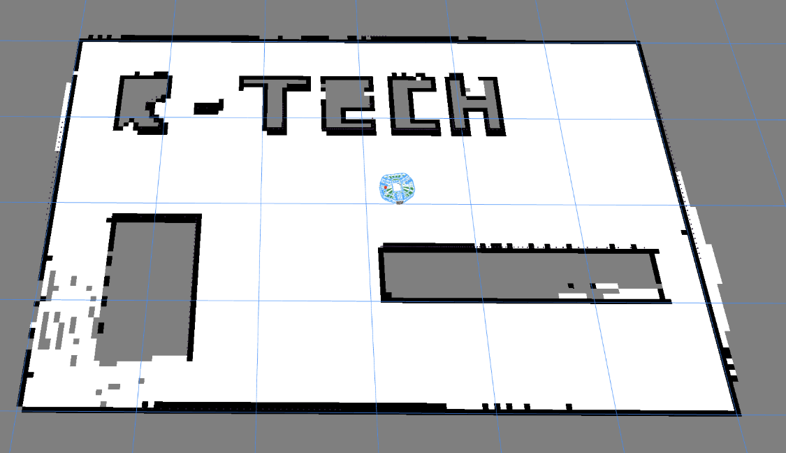

# Robotont Simulation: Nav2 + SLAM + Foxglove (ROS Jazzy)

The goal of this project is to create a virtual playground for a robot that should be able to:
1. Map the current environment using sensor data (SLAM)
2. Navigate through the environment using mapping and sensor data (Nav2)

The project uses a virtual copy of Robotont. The main focus was to build Foxglove-based visualizations; therefore, the Gazebo version was not properly tested and was added rather ad hoc. The application is dockerized and can therefore be run on any machine.



YouTube video overview: https://youtu.be/ZjLeJCJE14o


## Key features

Runtime:
1. User can navigate manually using teleop keys (`/cmd_vel`)
2. User can define 2D Pose markers for Robotont to drive to (`/goal_pose`) through Foxglove.
3. User can define multiple waypoints by placing 2D points (`/clicked_point`) through Foxglove. To execute the mission, the user can submit an Empty message to `/waypoints/execute`. To clear the points, the same message can be sent to `/waypoints/clear`.
4. User can store the map via the `/save_map` service call. Maps are stored in the `./saved_maps/<name>` folder.
5. The Robotont 3D model, generated map, planned path, costmap, markers, and much more can be visualized in Foxglove.

Launch:
1. User can select three different world models (`ROBOTONT_WORLD_MODE`): `custom`, which uses a manually generated JSON map; `gazebo`, which runs the Gazebo simulation (not well tested); and `simple`, which just exposes the 3D model of Robotont and runs a simple driver without mapping. 

Map generation:
1. When using `custom` world mode, the user can use a simple HTML tool to generate the map: `tools/world-editor/index.html` (Right click -> Open in Browser). The map has to be stored in the `worlds` folder. Later, it can be specified in the `.env` file.

# Running the code

## Quick start

1. Run `docker compose up --build`

2. Open Foxglove and connect to the web-socket interface: `ws://localhost:8765`

3. On the top-right "+" button, click "Import Layout"

4. Use the file from `foxglove/foxglove_robotont.json`

5. Enjoy :)

## Examples

1. Using Foxglove and big maze map
```bash
# settings.env
ROBOTONT_WORLD_MODE=custom
ROBOTONT_WORLD_FILE=/ws/worlds/maze_big.json
```
```bash
docker compose up --force-recreate # use this flag, if you face cache issues
```

2. Using Foxglove and loading a stored map:
```bash
ROBOTONT_WORLD_MODE=custom
ROBOTONT_MAP_NAME=robotont_hello
```
```bash
docker compose up
```

# Changing the configuration

## Description

You don't have to rebuild the container each time you want to edit the settings.

Env variables:
1. `defaults.env` - Generic ROS and package-specific parameters, network, etc.
2. `settings.env` - Simulation settings that define which simulation model and map we use, etc.

ROS Params (src/robotont_bringup/config/):
1. `simple_sim_driver.yaml` - Defines reference frames and the initial position for Robotont
2. `nav2_params.yaml` - Defines parameters used for autonomous navigation. The most important parameters during this project were costmap and velocity-related values
3. `slam_toolbox.yaml` - Defines parameters used for mapping the environment

## Full list of env variables:

| Variable | File | Options / example | Meaning |
|----------|------|-------------------|---------|
| `ROBOTONT_WORLD_MODE` | `settings.env` | `gazebo`, `custom`, `simple` | Selects the launch path in `scripts/launch_robotont.sh`. 1.`custom` uses JSON ray-casting; `gazebo` uses Gazebo-generated `/scan` and `/odom`; `simple` starts the lightweight Foxglove-only stack. |
| `ROBOTONT_WORLD_FILE` | `settings.env` | `/ws/worlds/room.json` | Custom-mode JSON vector world loaded by `fake_laser_node`. Host files live in `worlds/`. |
| `ROBOTONT_GAZEBO_WORLD_FILE` | `defaults.env` | `/ws/gazebo_worlds/robotont_room.sdf` | Gazebo-mode SDF world. Host files live in `src/robotont_bringup/worlds/`. |
| `ROBOTONT_MAP_NAME` | `settings.env` | empty, `my_room`, `/ws/saved_maps/my_room/my_room.posegraph` | Optional SLAM checkpoint to load at deploy. Empty starts fresh mapping. A basename first loads the bundle checkpoint at `/ws/saved_maps/<name>/<name>.posegraph` + `.data`. |
| `ROBOTONT_NAV2_PARAMS_FILE` | `defaults.env` | `/ws/config/nav2_params.yaml` | Mounted Nav2 params used by Gazebo and custom modes. |
| `ROBOTONT_SLAM_PARAMS_FILE` | `defaults.env` | `/ws/config/slam_toolbox.yaml` | Mounted slam_toolbox params used by Gazebo and custom modes. |
| `ROBOTONT_SIM_DRIVER_PARAMS_FILE` | `defaults.env` | `/ws/config/simple_sim_driver.yaml` | Mounted custom-mode driver params, including initial robot pose. |
| `ROBOTONT_PRIMARY_COLOR` | `settings.env` | `0.16 0.65 0.98 1.0` | URDF `xacro` `main_color` RGBA string. |
| `ROBOTONT_EXTRA_LAUNCH_ARGS` | `settings.env` | empty, `use_sim_time:=false` | Extra arguments appended to the selected `ros2 launch` command. |
| `ROBOTONT_FOXGLOVE_PORT` | `defaults.env` | `8765` | Container port used by `foxglove_bridge`. |
| `ROBOTONT_FOXGLOVE_HOST_PORT` | `defaults.env` | `8765` | Host port mapped to Foxglove. Connect to `ws://localhost:<host-port>`. |
| `ROS_DOMAIN_ID` | `defaults.env` | `42` | ROS 2 DDS domain for this stack. |
| `RMW_IMPLEMENTATION` | `defaults.env` | `rmw_fastrtps_cpp` | ROS middleware implementation. |
| `LIBGL_ALWAYS_SOFTWARE` | `defaults.env` | `1` | Keeps headless graphics paths software-rendered. |
| `GZ_PARTITION` / `IGN_PARTITION` | `defaults.env` | `robotont` | Gazebo Transport partition names. `IGN_*` exists for legacy Gazebo tooling. |
| `GZ_DISCOVERY_MSG_PORT` / `GZ_DISCOVERY_SRV_PORT` | `defaults.env` | `10317`, `10318` | Container UDP discovery ports for Gazebo Transport. |
| `GZ_DISCOVERY_MSG_HOST_PORT` / `GZ_DISCOVERY_SRV_HOST_PORT` | `defaults.env` | `10317`, `10318` | Host UDP discovery port mappings. |
| `IGN_DISCOVERY_MSG_PORT` / `IGN_DISCOVERY_SRV_PORT` | `defaults.env` | `10317`, `10318` | Legacy Gazebo discovery env values. |

---

# Business Logic

## What we simulate

| Piece | Role |
|--------|------|
| Robot | URDF from `robotont_description` (Gen3 Robotont mesh + kinematics for visualization). One base footprint, one 2D lidar frame (`base_scan`). |
| World | Small indoor room with walls and boxes. Gazebo mode: SDF + simplified physics (Gazebo). Custom mode: generated JSON map (`worlds/*.json`), no physics integration + ray-cast laser. |
| Odometry | Gazebo: Gazebo publishes `/odom` (world-referenced); `odom_tf` republishes as TF `odom -> base_footprint`. Custom: `simple_driver_node` integrates `/cmd_vel` and publishes `/odom` + TF `odom -> base_footprint`. |
| Laser | Gazebo: `/scan` via `ros_gz_bridge`. Custom: `fake_laser_node` publishes `sensor_msgs/LaserScan` on `/scan` from robot pose + JSON world map. |

Main tools:
1. SLAM_toolbox: subscribes to `/scan`, uses `odom` and `base_footprint`, and publishes `/map` (`nav_msgs/OccupancyGrid`) and TF `map -> odom`.
2. Nav2 stack (planner, controller, navigator, costmaps, smoother, velocity smoother). Goals use the `navigate_to_pose` action. Not using Nav2’s map server for localization. We are building the map with SLAM.


## Topics (main ones)

| Topic | Type | Typical publisher -> consumer |
|--------|------|------------------------------|
| `/scan` | `sensor_msgs/msg/LaserScan` | Gazebo bridge or `fake_laser` -> slam_toolbox, Nav2 costmaps |
| `/odom` | `nav_msgs/msg/Odometry` | Gazebo bridge or `simple_driver` -> slam_toolbox, Nav2, `fake_laser`, Foxglove |
| `/map` | `nav_msgs/msg/OccupancyGrid` | slam_toolbox -> Nav2 global costmap, Foxglove, `map_saver` |
| `/tf`, `/tf_static` | `tf2_msgs/msg/TFMessage` | `robot_state_publisher`, slam_toolbox, Nav2, Gazebo-related frames |
| `/cmd_vel` | `geometry_msgs/msg/Twist` | Nav2 velocity smoother -> simulator (Gazebo via bridge or `simple_driver`) |
| `/robot_description` | `std_msgs/msg/String` | `robot_state_publisher` / Foxglove |
| `/clock` | `rosgraph_msgs/msg/Clock` | Gazebo mode only; drives `use_sim_time` |
| `/goal_pose` | `geometry_msgs/msg/PoseStamped` | Foxglove / User -> `goal_bridge` |
| `/clicked_point` | `geometry_msgs/msg/PointStamped` | Foxglove / User -> `clicked_waypoint_node` -> `goal_bridge` |
| `/waypoints/execute` | `std_msgs/msg/Empty` | Foxglove / User -> `clicked_waypoint_node` -> `goal_bridge` |
| `/waypoints/clear` | `std_msgs/msg/Empty` | Foxglove / User -> `clicked_waypoint_node` |

## Actions

| Name | Type | Purpose |
|------|------|---------|
| `/navigate_to_pose` | `nav2_msgs/action/NavigateToPose` | Nav2 navigator: single-goal navigation |

### Services (illustrative)

| Service | Type | Notes |
|---------|------|--------|
| `/save_map` | `robotont_bringup/srv/SaveMap` | Helper: saves map files `./saved_maps`, so it can be loaded later |


---

# Some LLM notes, collected during debug:

_Here are some notes that were collected during debugging with an LLM. I kept them as is, so the text may be bloated. They may be useful if someone plans to tune Nav2 params._

**Why short navigation goals often work better than long ones?**

`/plan` is produced by **NavFn** on the **global costmap** (static SLAM map + inflated obstacles). **Execution** is **DWB** on the **local costmap** (rolling window in **`odom`**, mostly **live laser**). Short goals “work better” because several failure modes **scale with path length and clutter**:

1. **Geometric vs feasible** — NavFn optimizes a **2D grid** path and can cut corners that are **dynamically infeasible** for a differential drive at your speed/accel limits: tight sequential turns, grazing inflated cells, or sliding along a wall where **no short rollout** stays collision-free. DWB then returns **no valid trajectory** (`NoValidControl`) or near-zero velocity while the global polyline still looks fine.

2. **Unknown / stale map** — With **`allow_unknown: true`**, the planner may route through **unknown** cells. Until the laser **marks** them, the local costmap can disagree with the global plan; long paths expose more of that mismatch.

3. **SLAM motion of the map** — **`map → odom`** drifts and updates as you drive. A long path was generated in an **older** map pose; the **local** view (odom + scan) may no longer line up with the stored global path, so the middle of the route becomes “ambiguous” or blocked in cost space.

4. **Combinatorial load** — DWB samples **(vx × vθ × time)** rollouts. More obstacles in view → more rollouts hit **BaseObstacle** or **Oscillation** → the best admissible command drops toward **stop / spin**; short segments stay in **open** space so more samples survive.

5. **Costmap clipping** — The controller path segment is still **clipped to the local costmap** (see troubleshooting below). On a long detour, if the relevant polyline leaves that window, the **effective** plan DWB sees can shrink drastically.

**How to confirm (quick):** Watch **`controller_server`** logs for **`NoValidControl`**, **`Failed to make progress`**, or **`IllegalTrajectory`** (oscillation / obstacle). Temporarily set **`FollowPath.debug_trajectory_details: true`** in `nav2_params.yaml` (verbose). Compare **`/plan`** (map frame) with **`/local_costmap/costmap`** and the robot footprint along the route.

**Mitigations (conceptual):** shorter horizons (waypoints), **`allow_unknown: false`** once the map is built, a **smoother** or different **global planner**, **lower max speed** in clutter, **wider corridors** in JSON, or **local costmap static layer** from `/map` (heavier, but aligns local and global obstacles).


Troubleshooting Nav2 (path OK, robot stalls mid-route)

**`/plan` looks good but the robot stops or spins going around a wall** — that is usually **local control**, not global planning:

1. **DWB vs costmap** — The global planner ignores fine dynamics. **DWB** scores short trajectories against the **local costmap** (inflation + laser). If **path-following critics** dominate **BaseObstacle**, DWB can try to hug the global path into **inflated lethal** cells, find **no legal `cmd_vel`**, and you get a stall / spin while the global path still looks fine. This repo bumps **BaseObstacle** weight, softens **PathAlign / PathDist / Goal** scales, widens the **local costmap** window, and slightly **reduces inflation** so corridors stay feasible (tune in `nav2_params.yaml` under `controller_server` → `FollowPath` and `local_costmap` / `global_costmap`).

2. **Oscillation critic** — Legitimate **forward / back / turn** sequences around obstacles can be rejected as “oscillating.” `Oscillation.*` parameters under `FollowPath` relax resets (`oscillation_reset_dist`, `oscillation_reset_angle`, `x_only_threshold`).

3. **Progress** — **`PoseProgressChecker`** (also in `nav2_params.yaml`) treats **yaw** progress as valid so pure rotations on tight arcs do not trip “no progress” as easily.

**Debug:** In RViz or Foxglove, show **`/local_costmap/costmap`** with the robot on the path: if the path sits on **red/inflated** cells, widen the maze, lower inflation, or reduce `robot_radius` only if it matches the real robot.

**Local plan looks like a dot while `/plan` is long:** Nav2’s **FeasiblePathHandler** only keeps poses that fall **inside the rolling local costmap**. If the window is too small, the transformed path is **clipped at the map edge** and DWB sees almost nothing—raise **`local_costmap` width/height**, increase **`path_handler.prune_distance`**, and **`search_window`** (see `nav2_params.yaml`).

---
