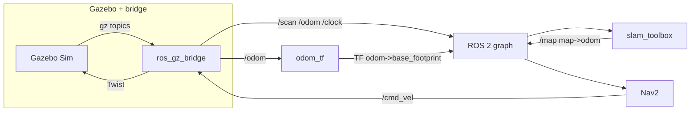
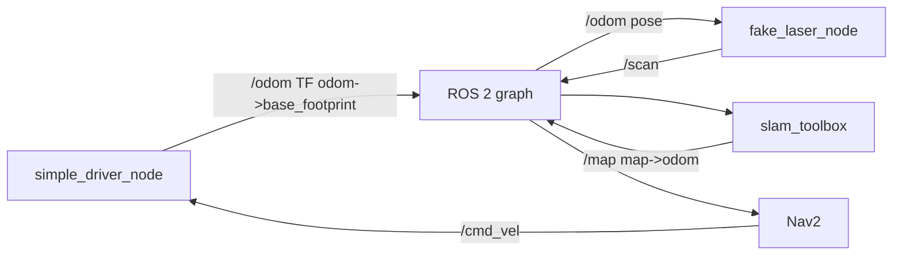

# Robotont Gazebo + Nav2 + SLAM + Foxglove
---

## 1. What we simulate

| Piece | Role |
|--------|------|
| **Robot** | URDF from `robotont_description` (Gen3-style Robotont mesh + kinematics for visualization). One **base footprint**, one **2D lidar** frame (`base_scan`). |
| **World** | Small indoor room with walls and boxes. **Gazebo** mode: SDF + simplified physics proxy. **Custom** mode: same geometry idea as JSON (`worlds/*.json`), no Gazebo physics—**kinematic** integration + **ray-cast** laser. |
| **Odometry** | **Gazebo:** Gazebo publishes `/odom` (world-referenced); `odom_tf` republishes as TF `odom → base_footprint`. **Custom:** `simple_driver_node` integrates `/cmd_vel` and publishes `/odom` + TF `odom → base_footprint` (no slip). |
| **Laser** | **Gazebo:** `/scan` via `ros_gz_bridge`. **Custom:** `fake_laser_node` publishes `sensor_msgs/LaserScan` on `/scan` from robot pose + JSON segments. |
| **SLAM** | **slam_toolbox** in **online async mapping** mode: subscribes to `/scan`, uses `odom` and `base_footprint`, publishes **`/map`** (`nav_msgs/OccupancyGrid`) and TF **`map → odom`**. |
| **Navigation** | **Nav2** stack (planner, controller, BT navigator, costmaps, smoother, velocity smoother). Goals use the **`navigate_to_pose`** action. **Not** using Nav2’s map server for localization—you are **building** the map with SLAM, not localizing in a pre-built map. |

---

## 2. Nav2 and SLAM quick context

**Frames (TF2)**

- **`map`**: SLAM’s global frame; origin and orientation of the occupancy grid.
- **`odom`**: Continuous odometry from the simulator (drift possible in real robots; here it is idealized).
- **`base_footprint` / `base_link` / `base_scan`**: Robot and sensor.

Typical chain: **`map → odom → base_footprint → …`**. slam_toolbox publishes **`map → odom`**. The simulator (Gazebo path + `odom_tf`, or custom driver) publishes **`odom → base_footprint`**.

**`/map`**

- Message type: **`nav_msgs/msg/OccupancyGrid`**.
- Published by **slam_toolbox** while mapping. Values: `-1` unknown, `0–100` cost, `100` lethal.

**Nav2 here**

- **Input:** laser **`/scan`**, TF, **`/map`** for global costmap, odometry.
- **Goal API:** `nav2_msgs/action/NavigateToPose` on action name **`/navigate_to_pose`** (standard Nav2).
- **Output:** smoothed velocity on **`/cmd_vel`** (`geometry_msgs/msg/Twist`). In this launch, internal **`cmd_vel_nav`** is remapped through **velocity_smoother** → **`/cmd_vel`**.
- **Lifecycle:** `lifecycle_manager_navigation` autostarts the Nav2 nodes listed in the launch file.

**Remap note:** Nav2 nodes remap **`/tf` → `tf`** and **`/tf_static` → `tf_static`** so they line up with slam_toolbox’s TF topic names in this bringup.

---

## 3. Data flow

### Gazebo mode (`ROBOTONT_WORLD_MODE=gazebo`)



- **`/clock`**: simulation time (`use_sim_time:=true` for Gazebo stack).
- **`goal_bridge`**: subscribes **`/goal_pose`** (`geometry_msgs/msg/PoseStamped`), sends goals to **`/navigate_to_pose`**.

### Custom JSON mode (`ROBOTONT_WORLD_MODE=custom`)



- **`use_sim_time`**: `false` for driver, laser, slam, and Nav2 in this mode (wall clock).
- Initial pose for the driver is YAML-driven: `config/simple_sim_driver.yaml` (`initial_x`, `initial_y`, `initial_theta`).

### `simple` / Foxglove-only mode

`robotont_foxglove.launch.py` — URDF + teleop-style demo **without** Nav2/SLAM/Gazebo from this compose path. See launch file for arguments (`linear_speed`, `angular_speed`, etc.).

---

## 4. ROS interface reference

### Topics (main ones)

| Topic | Type | Typical publisher → consumer |
|--------|------|------------------------------|
| `/scan` | `sensor_msgs/msg/LaserScan` | Gazebo bridge or `fake_laser` → slam_toolbox, Nav2 costmaps |
| `/odom` | `nav_msgs/msg/Odometry` | Gazebo bridge or `simple_driver` → slam_toolbox, Nav2, `fake_laser` |
| `/map` | `nav_msgs/msg/OccupancyGrid` | slam_toolbox → Nav2 global costmap, Foxglove, `map_saver_cli` |
| `/tf`, `/tf_static` | `tf2_msgs/msg/TFMessage` | `robot_state_publisher`, slam_toolbox, Nav2, Gazebo-related frames |
| `/cmd_vel` | `geometry_msgs/msg/Twist` | Nav2 velocity smoother → simulator (Gazebo via bridge or `simple_driver`) |
| `/goal_pose` | `geometry_msgs/msg/PoseStamped` | Foxglove / you → `goal_bridge` |
| `/robot_description` | `std_msgs/msg/String` | `robot_state_publisher` (via parameter) / Foxglove |
| `/clock` | `rosgraph_msgs/msg/Clock` | Gazebo mode only; drives `use_sim_time` |

### Actions

| Name | Type | Purpose |
|------|------|---------|
| `/navigate_to_pose` | `nav2_msgs/action/NavigateToPose` | Nav2 BT navigator: single-goal navigation |

### Services (illustrative)

| Service | Type | Notes |
|---------|------|--------|
| `/save_map` | `robotont_bringup/srv/SaveMap` | Our helper: saves occupancy files and a slam_toolbox checkpoint into `./saved_maps` (see below). |
| slam_toolbox services | e.g. `slam_toolbox/srv/SerializePoseGraph` | Serialize **pose graph** checkpoints so mapping can resume later. |

### Nodes by mode

**Gazebo Nav2 launch** (`robotont_nav2_gazebo.launch.py`): Gazebo sim, `ros_gz_bridge`, `robot_state_publisher`, `joint_state_publisher`, `odom_tf`, **slam_toolbox** (async lifecycle node), Nav2 servers + `lifecycle_manager_navigation`, `goal_bridge`, `map_saver_trigger`, `foxglove_bridge`.

**Custom Nav2 launch** (`robotont_nav2_slam.launch.py`): `robot_state_publisher`, `joint_state_publisher`, **`driver`** (`simple_driver_node`), **`fake_laser`**, slam_toolbox, Nav2 stack, `goal_bridge`, `map_saver_trigger`, `foxglove_bridge`.

---

## 5. Configuration (YAML and launch parameters)

| File / source | Used when | Purpose |
|----------------|-----------|---------|
| `src/robotont_bringup/config/nav2_params.yaml` | Gazebo + custom Nav2 | Nav2 **DWB** (up to **~1.0 m/s** linear, **1.4 rad/s** yaw per `FollowPath` + **velocity_smoother**), costmaps, **`path_handler`**, **`search_window`**, **PoseProgressChecker**. |
| `src/robotont_bringup/config/slam_toolbox.yaml` | Gazebo + custom Nav2 | slam_toolbox: `odom_frame`, `map_frame`, `base_frame`, `scan_topic`, resolution, ranges, **mapping** mode. |
| `src/robotont_bringup/config/simple_sim_driver.yaml` | **Custom** mode only | `initial_x`, `initial_y`, `initial_theta`, `odom_frame`, `base_frame`. |
| `worlds/*.json` | Custom mode | Geometry for `fake_laser` (`walls`, `boxes`). `origin` in JSON is **not** applied to TF (documentation / editor metadata). |
| `src/robotont_bringup/worlds/*.sdf` | Gazebo mode | Headless Gazebo world geometry, obstacles, proxy robot, and lidar. |

**Launch arguments**

- **`robotont_nav2_gazebo.launch.py`:** `primary_color`, `use_sim_time` (default `true`), `gazebo_world_file`, `nav2_params_file`, `slam_params_file`, `saved_map`, `foxglove_port`.
- **`robotont_nav2_slam.launch.py`:** `primary_color`, `world_file`, `nav2_params_file`, `slam_params_file`, `sim_driver_params_file`, `saved_map`, `foxglove_port`.

Pass-through from Docker: **`ROBOTONT_EXTRA_LAUNCH_ARGS`** is appended to the `ros2 launch ...` command (e.g. `foxglove_port:=9090`).

**Bringup-only node parameters (in launch files)**

- **`map_saver_trigger`:** `save_directory` (default `/ws/saved_maps`), `map_topic` (`/map`), `service_name` (`save_map`), `serialize_service` (`/slam_toolbox/serialize_map`), `save_map_timeout` (`10.0` seconds), `use_sim_time` (matches mode).
- **`slam_checkpoint_loader`:** `checkpoint` (basename or path under `/ws/saved_maps`), `service_name` (`/slam_toolbox/deserialize_map`), `match_type` (defaults to `START_AT_FIRST_NODE`).
- **`fake_laser`:** `world_file`, `odom_topic`, `scan_topic`, `frame_id`, `laser_x`, `laser_y`.
- **`goal_bridge`:** `goal_topic`, `default_frame` (`map`), `action_name` (`navigate_to_pose`).

---

## 6. Build, image, and environment

### Host layout

- **`src/`**: ROS packages (`robotont_bringup`, `robotont_description`, `robotont_simple_simulator`).
- **`worlds/`**: JSON worlds (mounted read-only at `/ws/worlds` in the container).
- **`saved_maps/`**: occupancy maps and SLAM checkpoints from `/save_map` (mounted read-write at `/ws/saved_maps`).
- **`src/robotont_bringup/config/`**: Nav2, SLAM, and custom simulator YAML (mounted read-only at `/ws/config`).
- **`src/robotont_bringup/worlds/`**: Gazebo SDF worlds (mounted read-only at `/ws/gazebo_worlds`).

### Docker image

- **Base:** `ros:jazzy-ros-base-noble`.
- **Build:** `colcon build --symlink-install` over `src/`.
- **Runtime `WORKDIR`:** `/ws/saved_maps` so slam_toolbox relative file saves land on the host mount when you use bare filenames.
- **Runtime mounts:** JSON worlds, SDF worlds, YAML params, and saved maps are bind-mounted by Compose, so changing them needs only a container restart.

Rebuild the image when you change **C++**, **package.xml/CMake**, **installed Python**, launch files, URDF/xacro, Dockerfile, or dependencies. Runtime inputs (`settings.env`, JSON worlds, SDF worlds, YAML params, saved maps) only need a restart.

### Env files

Plain Compose commands automatically pass both env files into the container through `docker-compose.yml`:

```bash
docker compose up --build
```

You can also pass both env files explicitly when you want Compose interpolation to see host-side overrides from those files:

```bash
docker compose --env-file defaults.env --env-file settings.env ...
```

`defaults.env` is for stable infrastructure defaults. `settings.env` is the editable simulation profile.
Shell variables can still override port interpolation values such as `ROBOTONT_FOXGLOVE_HOST_PORT`.

| Variable | File | Options / example | Meaning |
|----------|------|-------------------|---------|
| `ROBOTONT_WORLD_MODE` | `settings.env` | `gazebo`, `custom`, `simple`, `foxglove` | Selects the launch path in `scripts/launch_robotont.sh`. `custom` uses JSON ray-casting; `gazebo` uses Gazebo-generated `/scan` and `/odom`; `simple`/`foxglove` starts the lightweight Foxglove-only stack. |
| `ROBOTONT_WORLD_FILE` | `settings.env` | `/ws/worlds/room.json` | Custom-mode JSON vector world loaded by `fake_laser_node`. Host files live in `worlds/`. |
| `ROBOTONT_GAZEBO_WORLD_FILE` | `defaults.env` | `/ws/gazebo_worlds/robotont_room.sdf` | Gazebo-mode SDF world. Host files live in `src/robotont_bringup/worlds/`. |
| `ROBOTONT_MAP_NAME` | `settings.env` | empty, `my_room`, `/ws/saved_maps/my_room/my_room.posegraph` | Optional SLAM checkpoint to load at deploy. Empty starts fresh mapping. A basename first loads the bundle checkpoint at `/ws/saved_maps/<name>/<name>.posegraph` + `.data`, with legacy root-level checkpoints still supported. |
| `ROBOTONT_NAV2_PARAMS_FILE` | `defaults.env` | `/ws/config/nav2_params.yaml` | Mounted Nav2 params used by Gazebo and custom modes. |
| `ROBOTONT_SLAM_PARAMS_FILE` | `defaults.env` | `/ws/config/slam_toolbox.yaml` | Mounted slam_toolbox params used by Gazebo and custom modes. |
| `ROBOTONT_SIM_DRIVER_PARAMS_FILE` | `defaults.env` | `/ws/config/simple_sim_driver.yaml` | Mounted custom-mode driver params, including initial robot pose. |
| `ROBOTONT_PRIMARY_COLOR` | `settings.env` | `0.16 0.65 0.98 1.0` | URDF `xacro` `main_color` RGBA string. |
| `ROBOTONT_EXTRA_LAUNCH_ARGS` | `settings.env` | empty, `use_sim_time:=false` | Extra arguments appended to the selected `ros2 launch` command. |
| `ROBOTONT_FOXGLOVE_PORT` | `defaults.env` | `8765` | Container port used by `foxglove_bridge`. |
| `ROBOTONT_FOXGLOVE_HOST_PORT` | `defaults.env` | `8765` | Host port mapped to Foxglove. Connect to `ws://localhost:<host-port>`. |
| `ROS_DOMAIN_ID` | `defaults.env` | `42` | ROS 2 DDS domain for this stack. |
| `RMW_IMPLEMENTATION` | `defaults.env` | `rmw_fastrtps_cpp` | ROS middleware implementation. |
| `LIBGL_ALWAYS_SOFTWARE` | `defaults.env` | `1` | Keeps headless graphics paths software-rendered. |
| `GZ_PARTITION` / `IGN_PARTITION` | `defaults.env` | `robotont` | Gazebo Transport partition names. `IGN_*` exists for legacy Gazebo tooling. |
| `GZ_DISCOVERY_MSG_PORT` / `GZ_DISCOVERY_SRV_PORT` | `defaults.env` | `10317`, `10318` | Container UDP discovery ports for Gazebo Transport. |
| `GZ_DISCOVERY_MSG_HOST_PORT` / `GZ_DISCOVERY_SRV_HOST_PORT` | `defaults.env` | `10317`, `10318` | Host UDP discovery port mappings. |
| `IGN_DISCOVERY_MSG_PORT` / `IGN_DISCOVERY_SRV_PORT` | `defaults.env` | `10317`, `10318` | Legacy Gazebo discovery env values. |

After editing `settings.env`, `worlds/*.json`, `src/robotont_bringup/config/*.yaml`, or `src/robotont_bringup/worlds/*.sdf`, restart the container:

```bash
docker compose --env-file defaults.env --env-file settings.env restart robotont
```

### Quick run

```bash
cd robotics-project
docker compose up --build
```

Foxglove WebSocket: **`ws://localhost:8765`** (or your `ROBOTONT_FOXGLOVE_HOST_PORT`).

---

## 7. View in Foxglove

1. Open Foxglove Desktop or <https://app.foxglove.dev>.
2. Connect to `ws://localhost:8765` (adjust port if remapped).
3. Open a 3D panel; set **fixed frame** to **`map`** once SLAM is publishing.
4. Useful topics: `/tf`, `/tf_static`, `/map`, `/scan`, `/odom`, `/robot_description`, `/cmd_vel`, `/goal_pose`, `/navigate_to_pose/_action/status`.

**Map “floating” or drifting in the 3D view:** That is almost always the **3D panel fixed frame**, not a Foxglove defect. `/map` is published in frame **`map`**, while **slam_toolbox** continuously updates TF **`map → odom`** as it matches laser scans. If the fixed frame is **`odom`** or **`base_link`**, the occupancy grid is drawn in a parent frame that moves relative to how you intuit the world—so the map appears to swim. Set fixed frame to **`map`** for a stable grid; the robot and laser then move correctly on the map. Gazebo can look worse than the custom JSON sim because scans and timing differ, so SLAM may correct **`map → odom`** more visibly at startup.

Gazebo has no GUI in this setup; Foxglove is the main visualizer.

---

## 8. Send a Nav2 goal

**Foxglove Publish panel**

- Topic: **`/goal_pose`**
- Type: **`geometry_msgs/msg/PoseStamped`**

Example:

```json
{
  "header": { "stamp": { "sec": 0, "nanosec": 0 }, "frame_id": "map" },
  "pose": {
    "position": { "x": 1.5, "y": 0.5, "z": 0 },
    "orientation": { "x": 0, "y": 0, "z": 0, "w": 1 }
  }
}
```

**`goal_bridge`** forwards `/goal_pose` to the **`/navigate_to_pose`** action.

CLI example:

```bash
docker compose --env-file defaults.env --env-file settings.env exec robotont bash -lc 'source /opt/ros/jazzy/setup.bash && source /ws/install/setup.bash && ros2 topic pub --once /goal_pose geometry_msgs/msg/PoseStamped "{header: {frame_id: map}, pose: {position: {x: 1.5, y: 0.5, z: 0.0}, orientation: {w: 1.0}}}"'
```

---

## 9. Teleop (`/cmd_vel`)

```bash
cd robotics-project
docker compose --env-file defaults.env --env-file settings.env exec robotont bash
source /opt/ros/jazzy/setup.bash
source /ws/install/setup.bash
ros2 topic pub /cmd_vel geometry_msgs/msg/Twist \
  "{linear: {x: 0.2}, angular: {z: 0.5}}" --rate 10
```

Stop with `Ctrl+C`. When Nav2 is active, it also publishes `/cmd_vel` for autonomous motion.

---

## 10. Inspect the graph

```bash
docker compose --env-file defaults.env --env-file settings.env exec robotont bash -lc "source /opt/ros/jazzy/setup.bash && source /ws/install/setup.bash && ros2 node list"
```

**Gazebo mode** (illustrative): `bt_navigator`, `controller_server`, `foxglove_bridge`, `goal_bridge`, `joint_state_publisher`, `odom_tf`, `planner_server`, `robot_state_publisher`, `ros_gz_bridge`, `slam_toolbox`, … — **not** `driver` / `fake_laser`.

**Custom mode:** includes **`driver`**, **`fake_laser`**, same Nav2 + slam + bridge pattern.

```bash
docker compose --env-file defaults.env --env-file settings.env exec robotont bash -lc "source /opt/ros/jazzy/setup.bash && source /ws/install/setup.bash && ros2 topic list"
```

---

## 11. Save and resume mapping

Map bundles are written under **`saved_maps/`** on the host (`/ws/saved_maps` in the container).

### Recommended: `/save_map` (`robotont_bringup/srv/SaveMap`)

Runs Nav2 **`map_saver_cli`** against live **`/map`** and then calls slam_toolbox **`/slam_toolbox/serialize_map`**.

- **`{ "basename": "my_room" }`** → `saved_maps/my_room/my_room.yaml`, `.pgm`, `.posegraph`, `.data`.
- **`{ "basename": "" }`** → automatic bundle directory `saved_maps/map_YYYYMMDD_HHMMSS/`.

Foxglove: **Call service** → `/save_map` → type **`robotont_bringup/srv/SaveMap`**.

CLI:

```bash
docker compose --env-file defaults.env --env-file settings.env exec robotont bash -lc "source /opt/ros/jazzy/setup.bash && source /ws/install/setup.bash && ros2 service call /save_map robotont_bringup/srv/SaveMap '{basename: lobby}'"
```

Automatic name:

```bash
docker compose --env-file defaults.env --env-file settings.env exec robotont bash -lc "source /opt/ros/jazzy/setup.bash && source /ws/install/setup.bash && ros2 service call /save_map robotont_bringup/srv/SaveMap '{basename: \"\"}'"
```

Occupancy-only direct CLI:

```bash
docker compose --env-file defaults.env --env-file settings.env exec robotont bash -lc 'source /opt/ros/jazzy/setup.bash && source /ws/install/setup.bash && ros2 run nav2_map_server map_saver_cli -f /ws/saved_maps/robotont_demo_map'
```

Direct SLAM checkpoint CLI:

```bash
docker compose --env-file defaults.env --env-file settings.env exec robotont bash -lc 'source /opt/ros/jazzy/setup.bash && source /ws/install/setup.bash && ros2 service call /slam_toolbox/serialize_map slam_toolbox/srv/SerializePoseGraph "{filename: /ws/saved_maps/robotont_demo_map}"'
```

`/slam_toolbox/save_map` is slam_toolbox's built-in occupancy save service. It does **not** create the full bundle. Use this project's `/save_map` service when you want both visualization files (`.yaml` + `.pgm`) and resumable SLAM checkpoint files (`.posegraph` + `.data`).

### Resume a saved SLAM checkpoint during deploy

Set `ROBOTONT_MAP_NAME` in `settings.env`, or use a shell override before Compose. Use the basename without extension:

```bash
ROBOTONT_WORLD_MODE=custom ROBOTONT_MAP_NAME=my_room docker compose --env-file defaults.env --env-file settings.env up --build
```

This starts `slam_toolbox`, loads `/ws/saved_maps/my_room/my_room.posegraph` + `/ws/saved_maps/my_room/my_room.data`, and continues mapping from that checkpoint. Nav2 still consumes `/map` from `slam_toolbox`.

You may also pass an explicit container path:

```bash
ROBOTONT_WORLD_MODE=custom ROBOTONT_MAP_NAME=/ws/saved_maps/my_room.posegraph docker compose --env-file defaults.env --env-file settings.env up --build
```

For the new bundle layout, this is also valid:

```bash
ROBOTONT_WORLD_MODE=custom ROBOTONT_MAP_NAME=/ws/saved_maps/my_room docker compose --env-file defaults.env --env-file settings.env up --build
```

Occupancy-only files (`.yaml` + `.pgm`) are not enough to resume mapping. They are useful for visualization or static-map localization, but continuing an unfinished exploration needs the slam_toolbox checkpoint files (`.posegraph` + `.data`).

### slam_toolbox `SerializePoseGraph`

The helper above calls this for you. Direct service calls write **`filename.posegraph` / `filename.data`**; use `/ws/saved_maps/<name>` as the filename so the files land on the host mount.

---

## 12. World files and editor

**Gazebo:** `src/robotont_bringup/worlds/robotont_room.sdf` — room, obstacles, simplified robot + lidar.

**Custom JSON:** `worlds/room.json` (and your own). If the file is missing or invalid, `fake_laser_node` falls back to built-in demo geometry.

Editor (static HTML):

```text
tools/world-editor/index.html
```

Exported JSON shape (illustrative):

```json
{
  "version": 1,
  "name": "custom",
  "resolution": 0.05,
  "origin": { "x": -3, "y": -2 },
  "bounds": { "min_x": -3, "min_y": -2, "max_x": 3, "max_y": 2 },
  "walls": [
    { "x1": -3, "y1": -2, "x2": 3, "y2": -2 }
  ],
  "boxes": [
    { "name": "obstacle_1", "min_x": -1.2, "min_y": -0.8, "max_x": -0.8, "max_y": 0.8 }
  ]
}
```

Put files under **`worlds/`** — mounted at **`/ws/worlds`**; no image rebuild needed to change JSON.

### Initial robot pose (custom mode)

Gazebo spawn comes from the SDF. In **custom** mode, set **`src/robotont_bringup/config/simple_sim_driver.yaml`** (`initial_x`, `initial_y`, `initial_theta` in radians). Same axes as JSON walls/boxes. This file is mounted at `/ws/config/simple_sim_driver.yaml`; restart the container after changing it.

---

## 13. Mode switch examples

```bash
docker compose --env-file defaults.env --env-file settings.env down
ROBOTONT_WORLD_MODE=custom docker compose --env-file defaults.env --env-file settings.env up
```

Different JSON:

```bash
docker compose --env-file defaults.env --env-file settings.env down
ROBOTONT_WORLD_MODE=custom ROBOTONT_WORLD_FILE=/ws/worlds/custom.json docker compose --env-file defaults.env --env-file settings.env up
```

Gazebo (default):

```bash
ROBOTONT_WORLD_MODE=gazebo docker compose --env-file defaults.env --env-file settings.env up --build
```

Simple Foxglove-only stack:

```bash
ROBOTONT_WORLD_MODE=simple docker compose --env-file defaults.env --env-file settings.env up
```

---

## 14. Standalone launch commands (inside workspace)

Gazebo + Nav2 + SLAM:

```bash
ros2 launch robotont_bringup robotont_nav2_gazebo.launch.py
# Optional: primary_color:="0.16 0.65 0.98 1.0"  use_sim_time:=true  foxglove_port:=8765
```

Custom JSON + Nav2 + SLAM:

```bash
ros2 launch robotont_bringup robotont_nav2_slam.launch.py
# Optional: primary_color:=...  world_file:=/path/to/world.json  foxglove_port:=8765
```

Foxglove-only legacy demo:

```bash
ros2 launch robotont_bringup robotont_foxglove.launch.py
# Optional: generation:=3  primary_color:=...  linear_speed:=0.2  angular_speed:=0.5  foxglove_port:=8765
```

---

## 15. Gazebo vs Foxglove

Gazebo runs **headless** in `gazebo` mode and feeds ROS via **`ros_gz_bridge`**. Foxglove only sees **ROS topics** through **`foxglove_bridge`**; optional Gazebo Transport UDP ports **10317/10318** are exposed for external Gazebo tooling.

---

## Why short navigation goals often work better than long ones

`/plan` is produced by **NavFn** on the **global costmap** (static SLAM map + inflated obstacles). **Execution** is **DWB** on the **local costmap** (rolling window in **`odom`**, mostly **live laser**). Short goals “work better” because several failure modes **scale with path length and clutter**:

1. **Geometric vs feasible** — NavFn optimizes a **2D grid** path and can cut corners that are **dynamically infeasible** for a differential drive at your speed/accel limits: tight sequential turns, grazing inflated cells, or sliding along a wall where **no short rollout** stays collision-free. DWB then returns **no valid trajectory** (`NoValidControl`) or near-zero velocity while the global polyline still looks fine.

2. **Unknown / stale map** — With **`allow_unknown: true`**, the planner may route through **unknown** cells. Until the laser **marks** them, the local costmap can disagree with the global plan; long paths expose more of that mismatch.

3. **SLAM motion of the map** — **`map → odom`** drifts and updates as you drive. A long path was generated in an **older** map pose; the **local** view (odom + scan) may no longer line up with the stored global path, so the middle of the route becomes “ambiguous” or blocked in cost space.

4. **Combinatorial load** — DWB samples **(vx × vθ × time)** rollouts. More obstacles in view → more rollouts hit **BaseObstacle** or **Oscillation** → the best admissible command drops toward **stop / spin**; short segments stay in **open** space so more samples survive.

5. **Costmap clipping** — The controller path segment is still **clipped to the local costmap** (see troubleshooting below). On a long detour, if the relevant polyline leaves that window, the **effective** plan DWB sees can shrink drastically.

**How to confirm (quick):** Watch **`controller_server`** logs for **`NoValidControl`**, **`Failed to make progress`**, or **`IllegalTrajectory`** (oscillation / obstacle). Temporarily set **`FollowPath.debug_trajectory_details: true`** in `nav2_params.yaml` (verbose). Compare **`/plan`** (map frame) with **`/local_costmap/costmap`** and the robot footprint along the route.

**Mitigations (conceptual):** shorter horizons (waypoints), **`allow_unknown: false`** once the map is built, a **smoother** or different **global planner**, **lower max speed** in clutter, **wider corridors** in JSON, or **local costmap static layer** from `/map` (heavier, but aligns local and global obstacles).

---

## Troubleshooting Nav2 (path OK, robot stalls mid-route)

**`/plan` looks good but the robot stops or spins going around a wall** — that is usually **local control**, not global planning:

1. **DWB vs costmap** — The global planner ignores fine dynamics. **DWB** scores short trajectories against the **local costmap** (inflation + laser). If **path-following critics** dominate **BaseObstacle**, DWB can try to hug the global path into **inflated lethal** cells, find **no legal `cmd_vel`**, and you get a stall / spin while the global path still looks fine. This repo bumps **BaseObstacle** weight, softens **PathAlign / PathDist / Goal** scales, widens the **local costmap** window, and slightly **reduces inflation** so corridors stay feasible (tune in `nav2_params.yaml` under `controller_server` → `FollowPath` and `local_costmap` / `global_costmap`).

2. **Oscillation critic** — Legitimate **forward / back / turn** sequences around obstacles can be rejected as “oscillating.” `Oscillation.*` parameters under `FollowPath` relax resets (`oscillation_reset_dist`, `oscillation_reset_angle`, `x_only_threshold`).

3. **Progress** — **`PoseProgressChecker`** (also in `nav2_params.yaml`) treats **yaw** progress as valid so pure rotations on tight arcs do not trip “no progress” as easily.

**Debug:** In RViz or Foxglove, show **`/local_costmap/costmap`** with the robot on the path: if the path sits on **red/inflated** cells, widen the maze, lower inflation, or reduce `robot_radius` only if it matches the real robot.

**Local plan looks like a dot while `/plan` is long:** Nav2’s **FeasiblePathHandler** only keeps poses that fall **inside the rolling local costmap**. If the window is too small, the transformed path is **clipped at the map edge** and DWB sees almost nothing—raise **`local_costmap` width/height**, increase **`path_handler.prune_distance`**, and **`search_window`** (see `nav2_params.yaml`).

---
